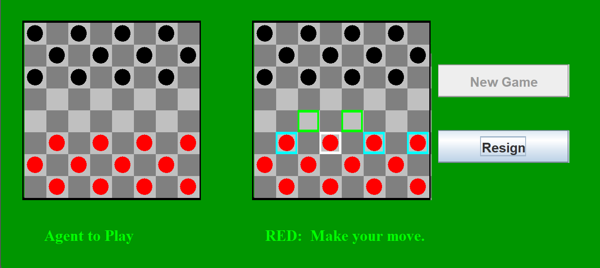

# Checkers AI with Monte Carlo Tree Search

A Java implementation of checkers with an AI opponent using Monte Carlo Tree Search (MCTS) algorithm.

## Features
- GUI-based checkers game implementation
- AI opponent using MCTS with modified UCB1 constant (1.25)
- Support for kings and multiple jumps
- Move validation following official American Checkers Federation rules
- Visual display of possible moves and jump paths

## Setup
1. Download the source files
2. Place them in a directory structure matching the package: `src/checkersai/`
3. Compile and run `Checkers.java`

## How to Play
1. Run the program to start a new game
2. Red pieces (human player) move first
3. Click on a piece to see valid moves
4. Click on the destination square to make a move
5. For multiple jumps, click on the final destination square
6. Use "New Game" button to restart
7. Use "Resign" button to forfeit

## Implementation Details
- Uses MCTS with UCB1 formula for move selection
- Modified exploration constant (C=1.25) optimized for endgame performance
- Mandatory jump rule enforced
- Multiple jump paths supported
- Kings can move backwards

## File Structure
- `Checkers.java`: Main game class and GUI
- `CheckersData.java`: Game state and rules
- `MonteCarloTreeSearch.java`: AI implementation
- `MCTree.java`: Tree structure for MCTS
- `MCNode.java`: Node implementation for MCTS

## Private Components
Some components of this project require permission to access:
- Solution to assignment
Please get in contact with me for access requests.

## Acknowledgments
- This project was created as part of COM S 472 at Iowa State University
- Original template/starter code provided by Professor Yan-Bin Jia
